# Tarea-Progra---III

## Con esta actividad buscamos crear un tensor, usando clases. También aplicaremos operaciones entre tensores, producto bidimensionales, producto punto y algunos métodos para los tensores.

## Atributos:

### - double* Datos; (alamacena los datos del tensor)
### - vector<int> dimensiones; (Recibe el vector con las dimensiones - max. 3)
### - int tamanio_total; (Obtenemos el tamaño del tensor, para eso usamos una funcion pequeña en private)
### - bool posee_datos; (verificamos la existencia de Datos)

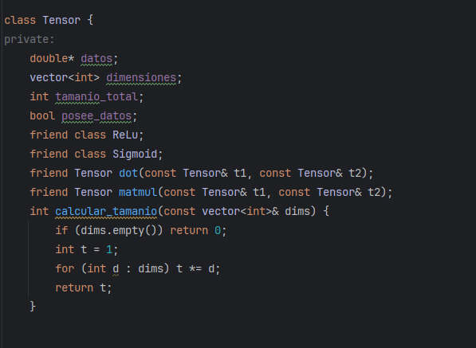


## Constructores

### 1.- Principal : Este recibe un vector de dimensiones y otro de valores. El vector de dimensiones se le atribuye a dimensiones y con el otro vector almacenamos los datos en el array.

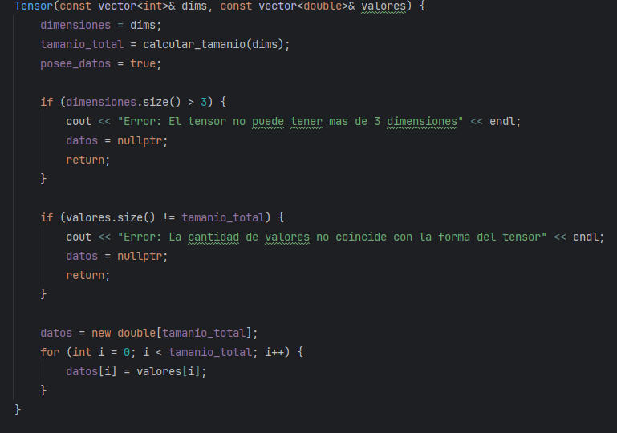

### //Cabe resaltar que se verifica que tenga max. 3 dimensiones y que el tamaño del tensor coincida con el de los valores.

### También añadimos un constructor vacío y uno para que tanga datos nulos en caso se requieras.

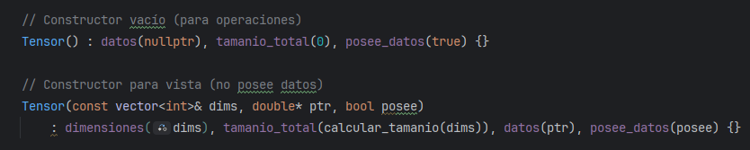


### 2.- Constructor y asiganción de copia

### Creamos el constructor de copia y su asignación

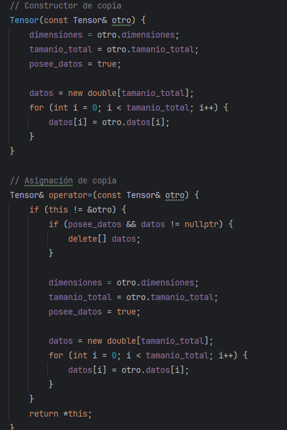

### 3.- Constructor de movimiento y asignación

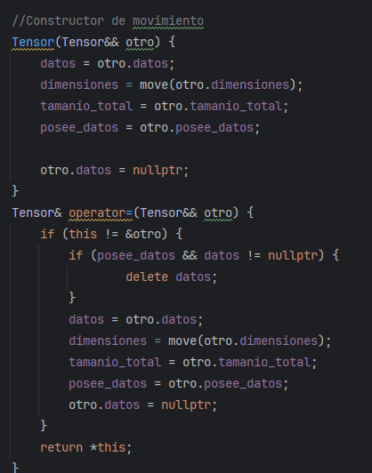

### 4.- Destructor
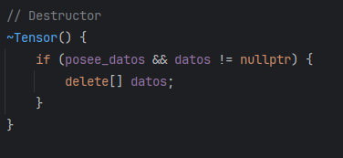

## Metodos Estáticos
**`ceros(dimensiones)`**: Crea un tensor con todas las posiciones inicializadas en 0.0
- **`unos(dimensiones)`**: Crea un tensor con todas las posiciones inicializadas en 1.0
- **`aleatorio(dimensiones, minimo, maximo)`**: Crea un tensor con valores aleatorios distribuidos uniformemente en el rango [minimo, maximo)
- **`rango(inicio, fin, paso=1.0)`**: Crea un tensor unidimensional con valores secuenciales desde `inicio` hasta `fin` (no inclusivo)

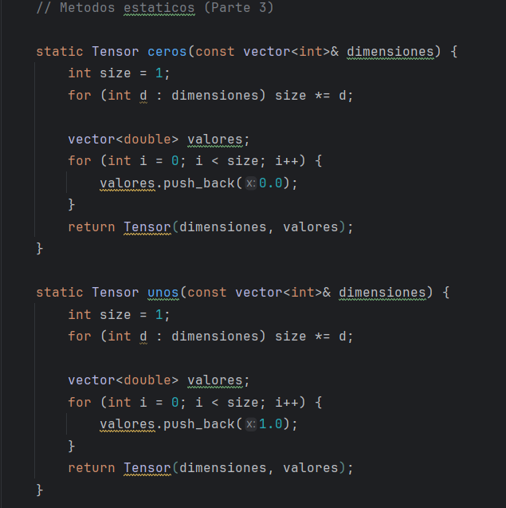

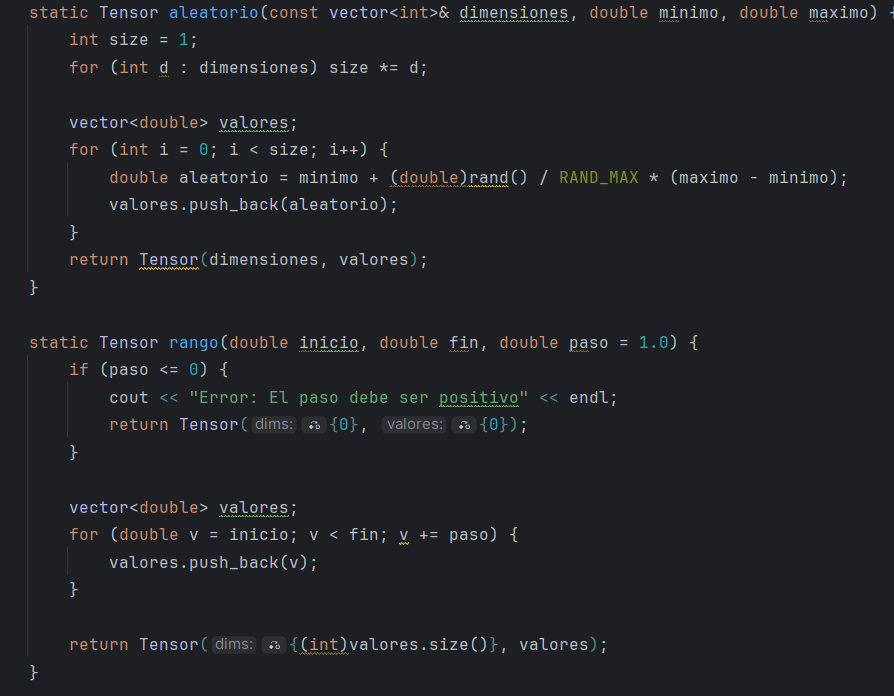

## Polimorfismo Y Transformaciones

### Para esta parte Usamos la herencia para crear las clases ReLu y Sigmoid. Es importante recalcar que esto provienene de la clase de TensorTransform, y con virtual.... = 0  obligamos a las clase hijas a usar esta función. Definimos en cada uno la función virtual, y modificamos según las condicones. Por ejemplo en ReLu, cada dato del array, se modifica comparando con el cero cual es mayor, pero en el sigmoid se utitliza una fórmula para poder cambiar cada dato de Datos.

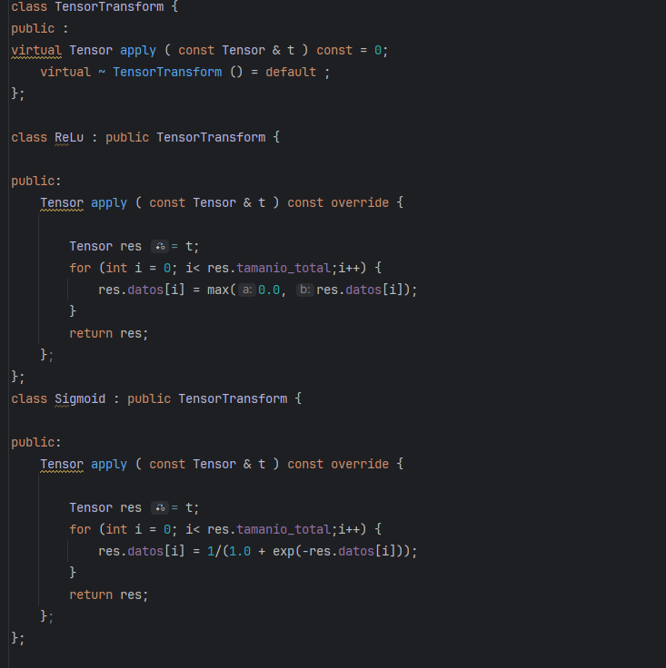

### Igualmente en la clase tensor ponemos un metodo de aplicación, para hacer ReLu y Sigmoid, y tenemos que devolver el tensor transformado.

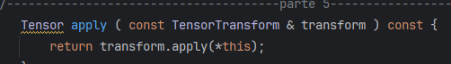

### Ejemplo de prueba

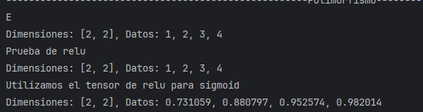

### //Es importante definir que para que la aplicacion en Tesnión funcione, debemos definir antes la clase TensroTransform


## Sobrecarga de operadores

Se implementaron los siguientes operadores con validación de dimensiones:

#### Operador `+` (tensor + tensor)
Suma elemento a elemento. Lanza error si las dimensiones no son compatibles.

#### Operador `-` (tensor - tensor)
Resta elemento a elemento. Lanza error si las dimensiones no son compatibles.

#### Operador `*` (tensor * tensor)
Multiplicación elemento a elemento (producto de Hadamard). Lanza error si las dimensiones no son compatibles.

#### Operador `*` (tensor * escalar)
Multiplica todos los elementos del tensor por un escalar.

#### Operador `*` (escalar * tensor)
Función externa que permite multiplicación con el escalar a la izquierda.

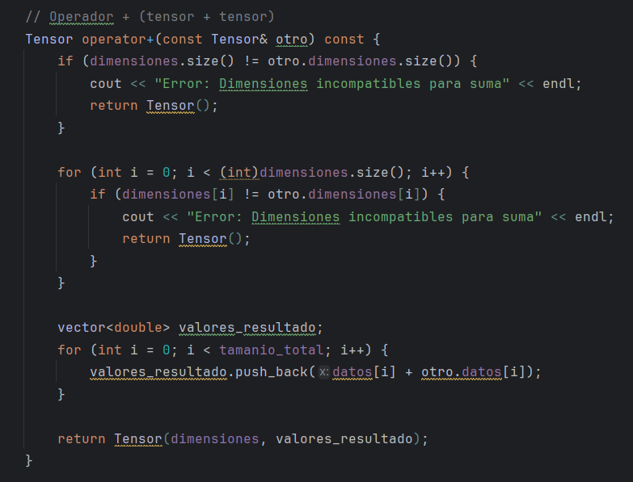

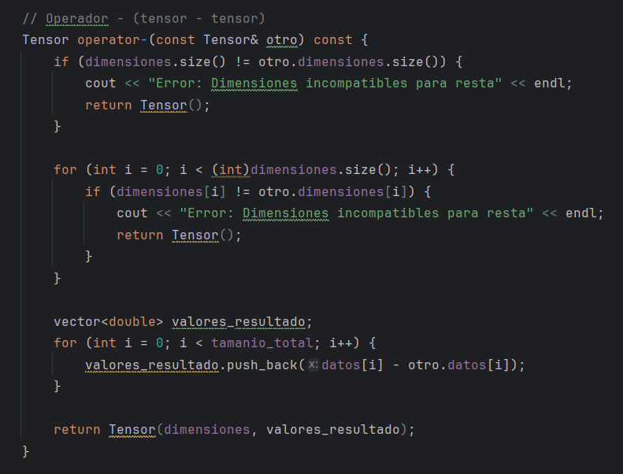

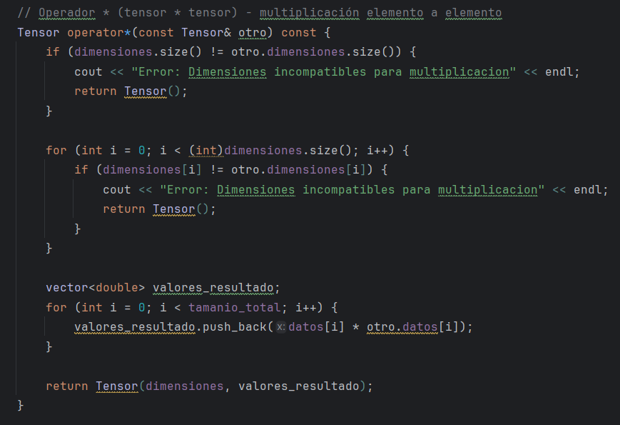

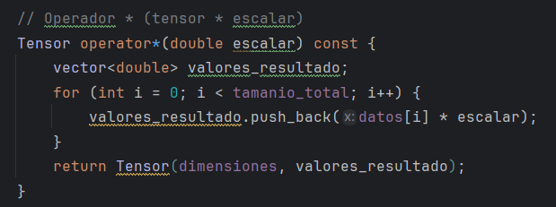

#### Características:
- Los operandos no se modifican (operadores const)
- Los operadores devuelven nuevos tensores
- Se valida compatibilidad de dimensiones antes de operar

#### Ejemplo de uso:
```cpp
Tensor A({2, 2}, {1, 2, 3, 4});
Tensor B({2, 2}, {5, 6, 7, 8});

Tensor C = A + B;      // Suma: [6, 8, 10, 12]
Tensor D = A - B;      // Resta: [-4, -4, -4, -4]
Tensor E = A * B;      // Producto elemento a elemento: [5, 12, 21, 32]
Tensor F = A * 2.0;    // Escalar derecho: [2, 4, 6, 8]
Tensor G = 3.0 * A;    // Escalar izquierdo: [3, 6, 9, 12]


## Modificación de dimensiones

#### Método `view(nuevas_dimensiones)`
Reinterpreta la forma de un tensor **sin copiar los datos subyacentes**.

**Requisitos:**
- El número total de elementos debe mantenerse constante
- El número de dimensiones no puede exceder tres
- El tensor original permanece válido

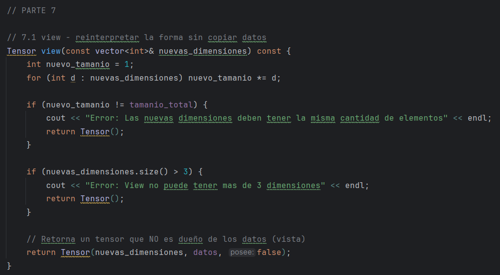

#### Método `unsqueeze(posicion)`
Agrega una dimensión de tamaño 1 en la posición especificada, **sin modificar los datos subyacentes**.

**Usos:**
- Preparar tensores para operaciones matriciales
- Adaptar dimensiones para concatenación o suma con bias
- Simular comportamiento de expand_dims de NumPy

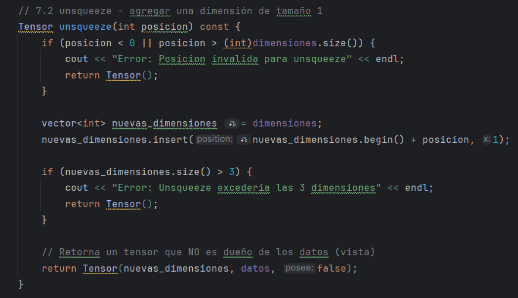

#### Características importantes:
- No copian los datos (crean vistas)
- Recalculan correctamente la forma lógica
- Garantizan que las dimensiones no excedan 3

## Concatenación 

## Funciones Amigas Permitidas

### Ahora vamos a ver dos funciones amigas que están siendo permitidas con friend. La primera es dot, que realiza el producto punto y devuelve un Tensor con una sola dimensión, y con el uncio valor del resultado que nos salío en el producto punto de ambos tensores.

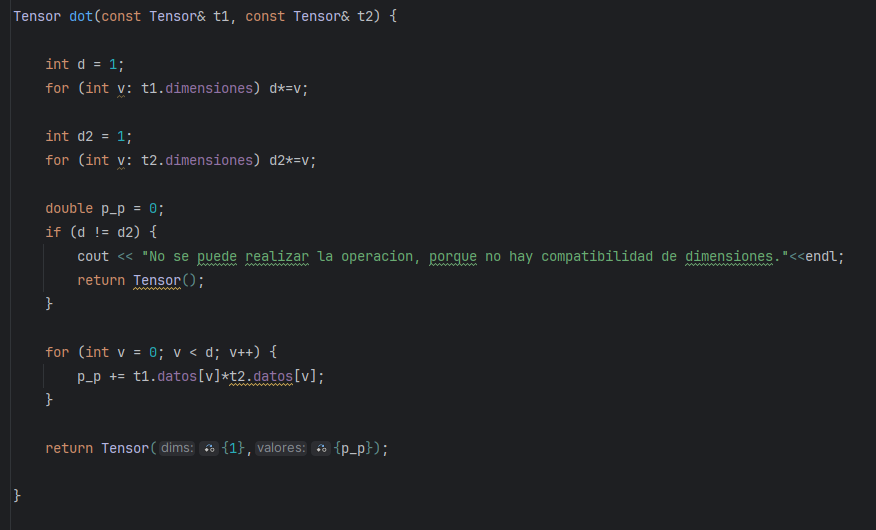
### Caso de prueba:  Estos son los tensores
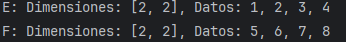

### Y al aplicarle dot a ambos este es el resultado:


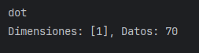

### La segunda función es matmul, que basicamente es una multiplicación de matrices.

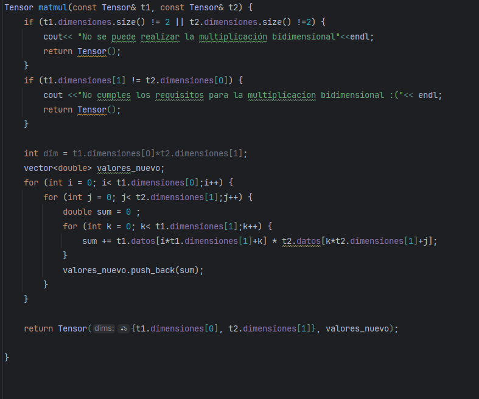

### Vemos el caso de prueba: Con estos dos tensores ahora.

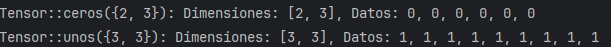

### Ahora vemos la dimension y los valores del nuevo tensor.


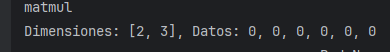


#### //Cabe reslatar que para cada uno se corresponde las retricciones necesarias, como la columna igual a filas en matmul, que solo tenga dos dimensiones.


## Red Neuronal

### Ahora vamos hacer el último paso, usarermos lo que hemos planteado apra una red neuronal.

### Primero Creamos un Tesnor aleatorio de dimensiones 1000x20x20.
### Segundo Utilizamos view para transformarlo a 1000x400.
### Tercero Multiplicamos con una matriz de dimensiones 400x100, para eso creamos una con aleatorio, y para la multiplicación usamos Matmul.
### Cuarto sumamos con un tensor de domensiones 1x100
### Quinto Aplicamos ReLu para ver si hay valores negativos.
### Sexto Multiplicamos por una matriz 100x10
### Septimo Sumamos con una matriz 1x10
### Finalmente palicamos sigmoid.


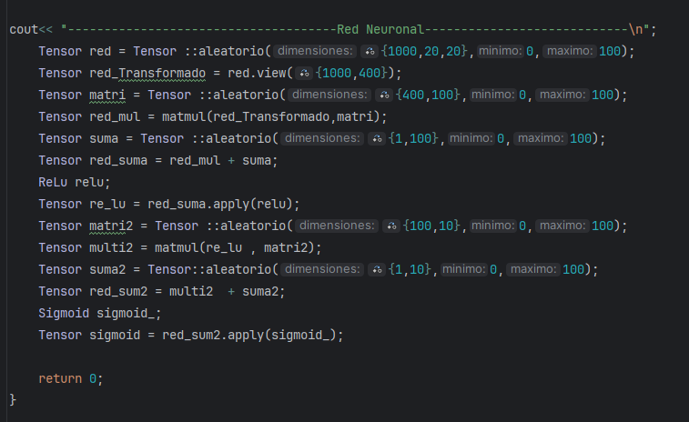

